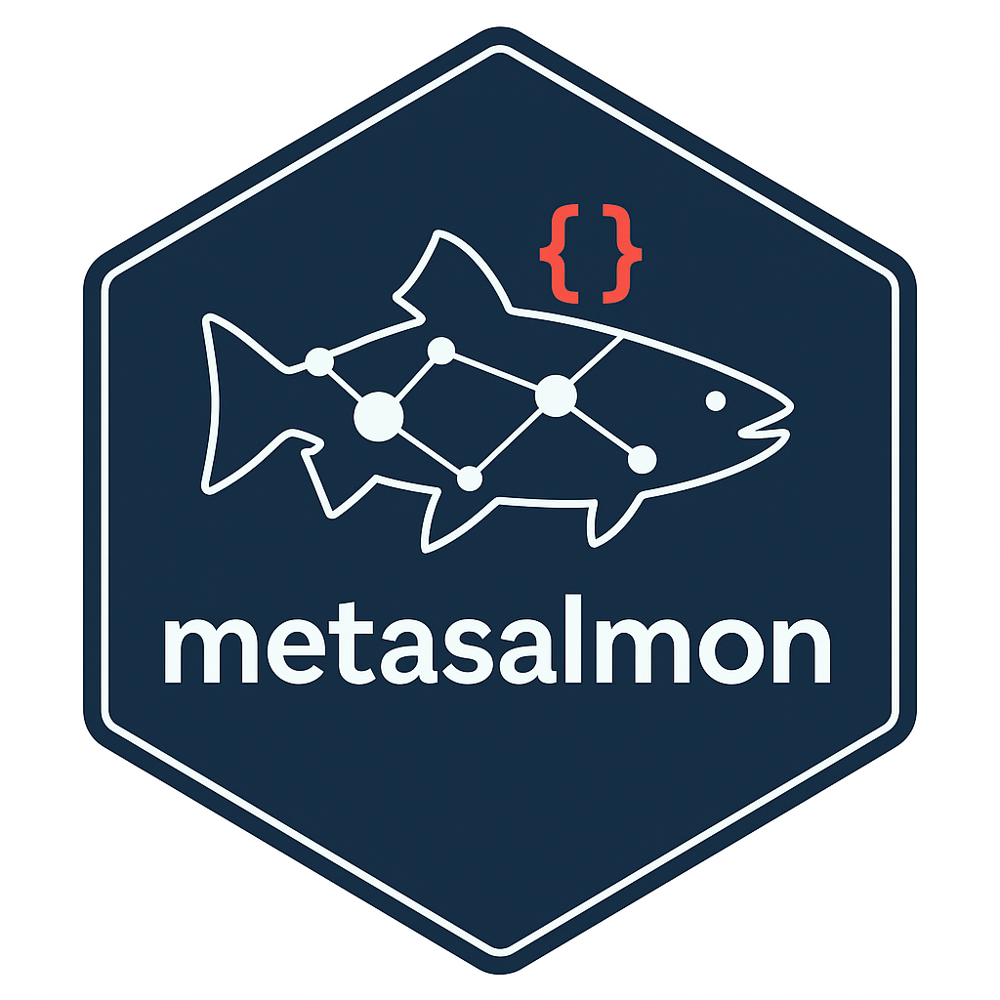

# metasalmon



## The Problem

You've spent years collecting salmon data. But when you try to share it:

- Colleagues ask "What does SPAWN_EST mean?"
- Combining datasets fails because everyone uses different column names
- Your future self opens old data and can't remember what the codes mean
- Other researchers can't use your data without emailing you for explanations

## The Solution

`metasalmon` wraps your salmon data with a **data dictionary** that travels with it—explaining every column, every code, and linking to standard scientific definitions. These definitions come from the [DFO Salmon Ontology](https://dfo-pacific-science.github.io/dfo-salmon-ontology/) and other published controlled vocabularies, and the data is packaged according to the [Salmon Data Package Specification](https://github.com/dfo-pacific-science/smn-data-pkg/blob/main/SPECIFICATION.md). For extra help, our custom [Salmon Data Standardizer GPT](https://chatgpt.com/g/g-69375eab4f608191863e8c23313a6f9f-salmon-data-standardizer) can generate metadata drafts, salmon data packages, and guide your data dictionary creation in coordination with this R package.  

**Think of it like adding a detailed legend to your spreadsheet that never gets lost.**

## What You Get

| Your Data | + metasalmon | = Data Package |
|-----------|--------------|----------------|
| Raw CSV files | Data dictionary | Self-documenting dataset |
| Cryptic column names | Clear descriptions | Anyone can understand it |
| Inconsistent codes | Linked to standards | Works with other datasets |

## Quick Example

```r
library(metasalmon)

# Load your escapement data
df <- read.csv("my-coho-data.csv")

# Generate a data dictionary automatically
dict <- infer_dictionary(df, dataset_id = "fraser-coho-2024", table_id = "escapement")

# Check that it looks right
validate_dictionary(dict)

# Add metadata about your dataset
dataset_meta <- tibble::tibble(
  dataset_id = "fraser-coho-2024",
  title = "Fraser River Coho Escapement Data",
  description = "Escapement monitoring data for coho salmon",
  creator = "Your Name",
  contact_name = "Your Name",
  contact_email = "your.email@dfo-mpo.gc.ca",
  license = "Open Government License - Canada"
)

table_meta <- tibble::tibble(
  dataset_id = "fraser-coho-2024",
  table_id = "escapement",
  file_name = "escapement.csv",
  table_label = "Escapement Data",
  description = "Coho escapement counts by population and year"
)

# Create a shareable package
create_salmon_datapackage(
  resources = list(escapement = df),
  dataset_meta = dataset_meta,
  table_meta = table_meta,
  dict = dict,
  path = "my-data-package"
)
```

**Result**: A folder containing your data + documentation that anyone can understand.

## Who Is This For?

| If you are... | Start here |
|---------------|------------|
| A biologist who wants to share data | [5-Minute Quickstart](articles/metasalmon.html) |
| Curious how it works | [How It Fits Together](#how-it-fits-together) |
| A data steward standardizing datasets | [Data Dictionary & Publication](articles/data-dictionary-publication.html) |
| Interested in AI-assisted documentation | [AI Assistance (Advanced)](articles/gpt-collaboration.html) |
| Reading CSVs from private GitHub repos | [GitHub CSV Access](articles/github-csv-access.html) |

## Video Walkthrough

[](https://www.example.com/metasalmon-intro-video)

[Watch: Creating Your First Data Package (3 min)](https://www.example.com/metasalmon-intro-video)

## Installation

```r
# Install from GitHub
install.packages("remotes")
remotes::install_github("dfo-pacific-science/metasalmon")
```

## What's In a Data Package?

When you create a package, you get a folder containing:

```
my-data-package/
  +-- escapement.csv          # Your data
  +-- column_dictionary.csv   # What each column means
  +-- codes.csv               # What each code value means (if applicable)
  +-- datapackage.json        # Machine-readable metadata
```

Anyone opening this folder - whether a colleague, a reviewer, or your future self - can immediately understand your data.

## Key Features

**For everyday use:**
- Automatically generate data dictionaries from your data frames
- Validate that your dictionary is complete and correct
- Create shareable packages that work across R, Python, and other tools
- Read CSVs directly from private GitHub repositories

**For data stewards (optional):**
- Link columns to standard DFO Salmon Ontology terms
- Add I-ADOPT measurement metadata (property, entity, unit, constraint)
- Use AI assistance to help write descriptions

## Getting Help

- [Frequently Asked Questions](articles/faq.html)
- [Glossary of Terms](articles/glossary.html)
- [Report a bug](https://github.com/dfo-pacific-science/metasalmon/issues)
- [Request a feature](https://github.com/dfo-pacific-science/metasalmon/issues)
- [DFO Salmon Ontology](https://w3id.org/gcdfo/salmon)
- [Salmon Data Package Specification](https://github.com/dfo-pacific-science/smn-data-pkg/blob/main/SPECIFICATION.md)

## How It Fits Together

`metasalmon` brings together four pieces: your raw data, the Salmon Data Package specification, the DFO Salmon Ontology (and other vocabularies), and the Salmon Data Standardizer GPT. When you finish the workflow, the dictionary, dataset/table metadata, and optional code lists are already aligned with the specification, which makes the package ready to publish. The ontology keeps the column meanings consistent, and the GPT assistant helps draft descriptions and term choices so you can close the loop without juggling multiple tools.

The high-level flow is:

- **Raw tables** lead into `column_dictionary.csv` (and `codes.csv` when there are categorical columns).
- **Dataset/table metadata** fill the required specification fields (title, description, creator, contact, etc.), so the package folder can be shared or uploaded.
- **The DFO Salmon Ontology and published vocabularies** supply `term_iri`/`entity_iri` links that describe what each column and row represents.
- **`create_salmon_datapackage()`** consumes the metadata, dictionary, codes, and data to write the files in the Salmon Data Package format, while the GPT assistant helps polish the metadata and suggests vocabulary links.

<script>
// Prevent Mermaid from auto-rendering before we prepare the code blocks.
window.mermaid = { startOnLoad: false };
</script>
<script src="https://cdn.jsdelivr.net/npm/mermaid/dist/mermaid.min.js"></script>
<script>
document.addEventListener("DOMContentLoaded", function () {
  if (typeof mermaid === "undefined") return;

  mermaid.initialize({ startOnLoad: false });

  // Render the "How It Fits Together" diagram.
  var src = document.getElementById("how-it-fits-together-mermaid");
  var target = document.getElementById("how-it-fits-together-diagram");
  if (!src || !target || typeof mermaid.render !== "function") return;

  var code = src.value || src.textContent || "";
  Promise.resolve(mermaid.render("how-it-fits-together", code))
    .then(function (res) {
      target.innerHTML = res.svg || res;
    })
    .catch(function () {
      // If rendering fails, leave the source text hidden and skip the diagram.
    });
});
</script>
<div id="how-it-fits-together-diagram"></div>
<textarea id="how-it-fits-together-mermaid" style="display:none">
flowchart LR
  RawData["Raw data tables"] --> Dict["column_dictionary.csv + codes.csv"]
  Dict["column_dictionary.csv + codes.csv"] --> Dataset["dataset.csv + tables.csv"]
  Dataset["dataset.csv + tables.csv"] --> Package["Salmon Data Package files + datapackage.json"]
  Dataset["dataset.csv + tables.csv"] --> Spec["Salmon Data Package specification"]
  Spec["Salmon Data Package specification"] --> Package["Salmon Data Package files + datapackage.json"]
  Ontology["DFO Salmon Ontology and published vocabularies"] --> Dict["column_dictionary.csv + codes.csv"]
  Ontology["DFO Salmon Ontology and published vocabularies"] --> Package["Salmon Data Package files + datapackage.json"]
  GPT["Salmon Data Standardizer GPT"] --> Dict["column_dictionary.csv + codes.csv"]
  GPT["Salmon Data Standardizer GPT"] --> Package["Salmon Data Package files + datapackage.json"]
</textarea>

This section now captures the complete workflow, so you can stay on this page and still understand how the specification, ontology, package creation, and GPT support each other before diving into the detailed guides.

## For Developers

<details>
<summary>Development setup and package structure</summary>

### Installation for Development

```r
install.packages(c("devtools", "roxygen2", "testthat", "knitr", "rmarkdown",
                   "tibble", "readr", "jsonlite", "cli", "rlang", "dplyr",
                   "tidyr", "purrr", "withr", "frictionless"))
```

### Build and Check

```r
devtools::document()
devtools::test()
devtools::check()
devtools::build_vignettes()
pkgdown::build_site()
```

### Package Structure

- `R/`: Core functions for dictionary and package operations
- `inst/extdata/`: Example data files and templates
- `tests/testthat/`: Automated tests
- `vignettes/`: Long-form documentation
- `docs/`: pkgdown site output

### DFO Salmon Ontology

This package can optionally link your data to the [DFO Salmon Ontology](https://w3id.org/gcdfo/salmon). You don't need to understand ontologies to use metasalmon - this is handled automatically for users who want it.

See the [Reusing Standards for Salmon Data Terms](articles/reusing-standards-salmon-data-terms.html) guide for details.

</details>
