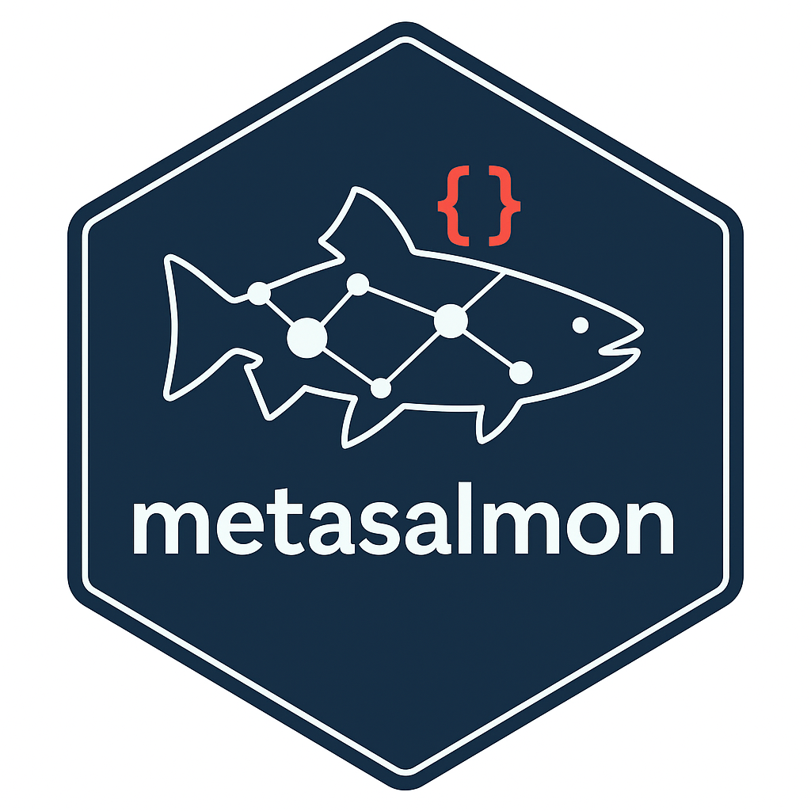

# metasalmon



## The Problem

You’ve spent years collecting salmon data. But when you try to share it:

- Colleagues ask “What does SPAWN_EST mean?”
- Combining datasets fails because everyone uses different column names
- Your future self opens old data and can’t remember what the codes mean
- Other researchers can’t use your data without emailing you for
  explanations

## The Solution

`metasalmon` wraps your salmon data with a **data dictionary** that
travels with it—explaining every column, every code, and linking to
standard scientific definitions. These definitions come from the [DFO
Salmon
Ontology](https://dfo-pacific-science.github.io/dfo-salmon-ontology/)
and other published controlled vocabularies, and the data is packaged
according to the [Salmon Data Package
Specification](https://github.com/dfo-pacific-science/smn-data-pkg/blob/main/SPECIFICATION.md).
For extra help, our custom [Salmon Data Standardizer
GPT](https://chatgpt.com/g/g-69375eab4f608191863e8c23313a6f9f-salmon-data-standardizer)
can generate metadata drafts, salmon data packages, and guide your data
dictionary creation in coordination with this R package.

**Integration context:** See the Salmon Data Integration System overview
page (<https://br-johnson.github.io/salmon-data-integration-system/>)
and walkthrough video
(<https://youtu.be/B0Zqac49zng?si=VmOjbfMDMd2xW9fH>).

**Think of it like adding a detailed legend to your spreadsheet that
never gets lost.**

## What You Get

| Your Data            | \+ metasalmon       | = Data Package            |
|----------------------|---------------------|---------------------------|
| Raw CSV files        | Data dictionary     | Self-documenting dataset  |
| Cryptic column names | Clear descriptions  | Anyone can understand it  |
| Inconsistent codes   | Linked to standards | Works with other datasets |

## Quick Example

Install, infer a dictionary, and validate. Then jump to the 5-minute
quickstart for the full publishing workflow.

``` r

# Install from GitHub (recommended)
# install.packages("remotes")
# remotes::install_github("dfo-pacific-science/metasalmon")

library(metasalmon)

# Load the example NuSEDS Fraser Coho data included in metasalmon
data_path <- system.file("extdata", "nuseds-fraser-coho-sample.csv", package = "metasalmon")
df <- readr::read_csv(data_path, show_col_types = FALSE)

# Generate starter dictionary
dict <- infer_dictionary(df, dataset_id = "fraser-coho-2024", table_id = "escapement")
validate_dictionary(dict)

# Optional: attach semantic suggestions (still no auto-commit to IRIs)
dict <- infer_dictionary(
  df,
  dataset_id = "fraser-coho-2024",
  table_id = "escapement",
  seed_semantics = TRUE,
  seed_verbose = TRUE
)
attr(dict, "semantic_suggestions") |> head()

# If the top-ranked suggestions look right, explicitly apply them.
# By default this fills only missing fields and leaves existing IRIs alone.
dict <- apply_semantic_suggestions(dict, columns = "NATURAL_SPAWNER_COUNT")
```

To continue:

- [5-Minute
  Quickstart](https://dfo-pacific-science.github.io/metasalmon/articles/metasalmon.md)
  — create the full package with metadata and export it.
- [Publishing Data
  Packages](https://dfo-pacific-science.github.io/metasalmon/articles/data-dictionary-publication.md)
  — end-to-end publication checklist.
- [Linking to Standard
  Vocabularies](https://dfo-pacific-science.github.io/metasalmon/articles/reusing-standards-salmon-data-terms.md)
  — pick `term_iri`, `property_iri`, and `entity_iri` with confidence.

## Who Is This For?

| If you are… | Start here |
|----|----|
| A biologist who wants to share data | [5-Minute Quickstart](https://dfo-pacific-science.github.io/metasalmon/articles/metasalmon.md) |
| Curious how it works | [How It Fits Together](#how-it-fits-together) |
| A data steward standardizing datasets | [Data Dictionary & Publication](https://dfo-pacific-science.github.io/metasalmon/articles/data-dictionary-publication.md) |
| Interested in AI-assisted documentation | [AI Assistance (Advanced)](https://dfo-pacific-science.github.io/metasalmon/articles/gpt-collaboration.md) |
| Reading CSVs from private GitHub repos | [GitHub CSV Access](https://dfo-pacific-science.github.io/metasalmon/articles/github-csv-access.md) |

## Video Walkthrough

[Watch: Creating Your First Data
Package](https://youtu.be/B0Zqac49zng?si=VmOjbfMDMd2xW9fH)

## Installation

``` r

# Install from GitHub
install.packages("remotes")
remotes::install_github("dfo-pacific-science/metasalmon")
```

## What’s In a Data Package?

When you create a package, you get a folder containing:

    my-data-package/
      +-- escapement.csv          # Your data
      +-- column_dictionary.csv   # What each column means
      +-- codes.csv               # What each code value means (if applicable)
      +-- datapackage.json        # Machine-readable metadata

Anyone opening this folder - whether a colleague, a reviewer, or your
future self - can immediately understand your data.

## Key Features

**For everyday use:**

- Automatically generate data dictionaries from your data frames
- Validate that your dictionary is complete and correct
- Create shareable packages that work across R, Python, and other tools
- Read CSVs directly from private GitHub repositories

**For data stewards (optional):**

- Link columns to standard DFO Salmon Ontology terms
- Add I-ADOPT measurement metadata (property, entity, unit, constraint)
- Use AI assistance to help write descriptions
- Suggest Darwin Core Data Package table/field mappings for biodiversity
  data
- Opt in to DwC-DP export hints via
  `suggest_semantics(..., include_dwc = TRUE)` while keeping the Salmon
  Data Package as the canonical deliverable.
- Generate HNAP-aware EDH metadata XML for DFO Enterprise Data Hub
  upload workflows via
  [`edh_build_iso19139_xml()`](https://dfo-pacific-science.github.io/metasalmon/reference/edh_build_iso19139_xml.md)
  (with legacy ISO 19139 fallback still available).
- Role-aware vocabulary search with
  [`find_terms()`](https://dfo-pacific-science.github.io/metasalmon/reference/find_terms.md)
  and
  [`sources_for_role()`](https://dfo-pacific-science.github.io/metasalmon/reference/sources_for_role.md):
  - Units: QUDT preferred, then NVS P06
  - Entities/taxa: GBIF and WoRMS taxon resolvers
  - Properties: STATO/OBA measurement ontologies
  - Cross-source agreement boosting for high-confidence matches
- Per-source diagnostics, scoring, and optional rerank explain why
  [`find_terms()`](https://dfo-pacific-science.github.io/metasalmon/reference/find_terms.md)
  matches rank where they do and expose failures, so you can tune
  role-aware queries with confidence.
- End-to-end semantic QA loop with
  [`fetch_salmon_ontology()`](https://dfo-pacific-science.github.io/metasalmon/reference/fetch_salmon_ontology.md) +
  [`validate_semantics()`](https://dfo-pacific-science.github.io/metasalmon/reference/validate_semantics.md),
  plus
  [`deduplicate_proposed_terms()`](https://dfo-pacific-science.github.io/metasalmon/reference/deduplicate_proposed_terms.md)
  to prevent term proliferation before opening ontology issues.
- NuSEDS method crosswalk helpers:
  [`nuseds_enumeration_method_crosswalk()`](https://dfo-pacific-science.github.io/metasalmon/reference/nuseds_enumeration_method_crosswalk.md)
  and
  [`nuseds_estimate_method_crosswalk()`](https://dfo-pacific-science.github.io/metasalmon/reference/nuseds_estimate_method_crosswalk.md)
  for mapping legacy values to canonical method families.

## Getting Help

- [Frequently Asked
  Questions](https://dfo-pacific-science.github.io/metasalmon/articles/faq.md)
- [Glossary of
  Terms](https://dfo-pacific-science.github.io/metasalmon/articles/glossary.md)
- [Report a
  bug](https://github.com/dfo-pacific-science/metasalmon/issues)
- [Request a
  feature](https://github.com/dfo-pacific-science/metasalmon/issues)
- [DFO Salmon Ontology](https://w3id.org/gcdfo/salmon/)
- [Salmon Data Package
  Specification](https://github.com/dfo-pacific-science/smn-data-pkg/blob/main/SPECIFICATION.md)

## How It Fits Together

`metasalmon` brings together four pieces: your raw data, the Salmon Data
Package specification, the DFO Salmon Ontology (and other vocabularies),
and the Salmon Data Standardizer GPT. When you finish the workflow, the
dictionary, dataset/table metadata, and optional code lists are already
aligned with the specification, which makes the package ready to
publish. The ontology keeps the column meanings consistent, and the GPT
assistant helps draft descriptions and term choices so you can close the
loop without juggling multiple tools.

The high-level flow is:

- **Raw tables** lead into `column_dictionary.csv` (and `codes.csv` when
  there are categorical columns).
- **Dataset/table metadata** fill the required specification fields
  (title, description, creator, contact, etc.), so the package folder
  can be shared or uploaded.
- **The DFO Salmon Ontology and published vocabularies** supply
  `term_iri`/`entity_iri` links that describe what each column and row
  represents.
- **[`create_salmon_datapackage()`](https://dfo-pacific-science.github.io/metasalmon/reference/create_salmon_datapackage.md)**
  consumes the metadata, dictionary, codes, and data to write the files
  in the Salmon Data Package format, while the GPT assistant helps
  polish the metadata and suggests vocabulary links.

## For Developers

Development setup and package structure

### Installation for Development

``` r

install.packages(c("devtools", "roxygen2", "testthat", "knitr", "rmarkdown",
                   "tibble", "readr", "jsonlite", "cli", "rlang", "dplyr",
                   "tidyr", "purrr", "withr", "frictionless"))
```

### Build and Check

``` r

devtools::document()
devtools::test()
devtools::check()
devtools::build_vignettes()
pkgdown::build_site()
```

### Package Structure

- `R/`: Core functions for dictionary and package operations
- `inst/extdata/`: Example data files and templates
- `tests/testthat/`: Automated tests
- `vignettes/`: Long-form documentation
- `docs/`: pkgdown site output

### DFO Salmon Ontology

This package can optionally link your data to the [DFO Salmon
Ontology](https://w3id.org/gcdfo/salmon/). You don’t need to understand
ontologies to use metasalmon - this is handled automatically for users
who want it.

See the [Reusing Standards for Salmon Data
Terms](https://dfo-pacific-science.github.io/metasalmon/articles/reusing-standards-salmon-data-terms.md)
guide for details.
